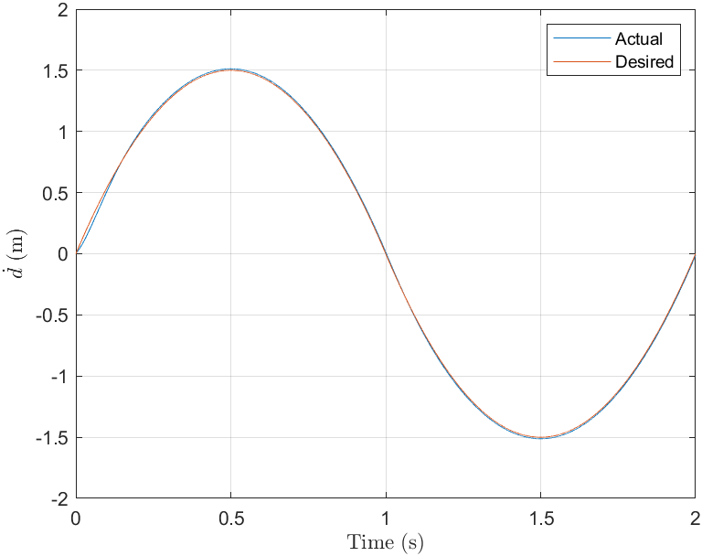
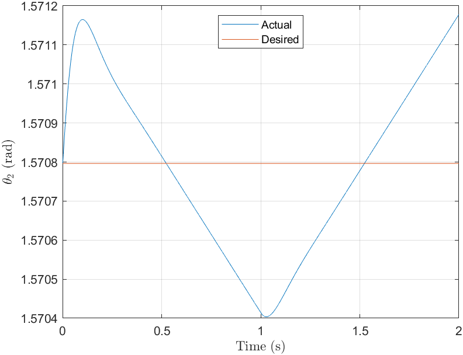
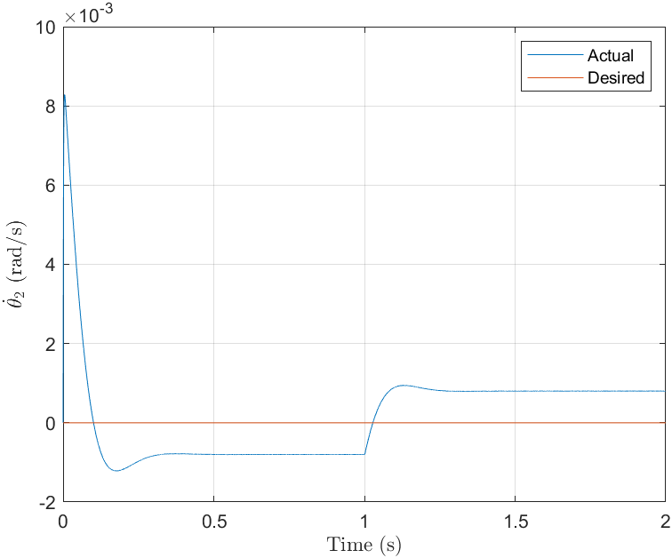
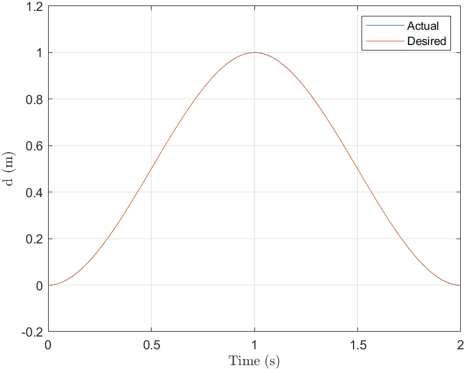
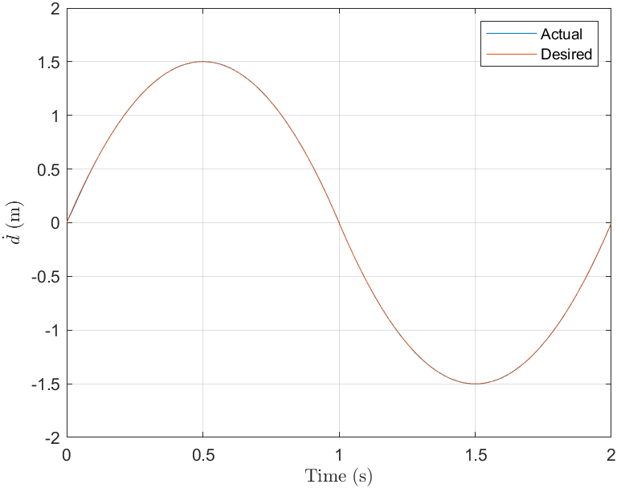
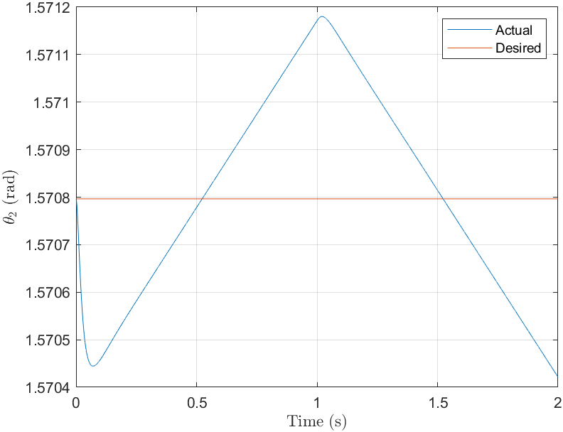
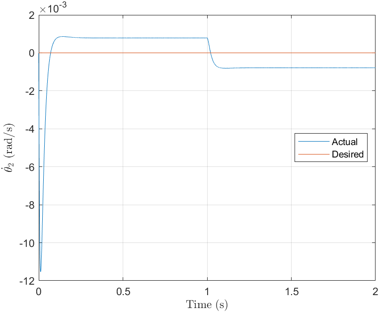

## Week 10 - Assignment 10

Codes present for

1.  MCQ - NIL

2.  Subjective - Q2 and Q3

**Plots**
  1. Subjective : Q2

  

   
  

  

   
  

  

   
  

  

   
  

2.  Subjective : Q3

 

 

 

 

