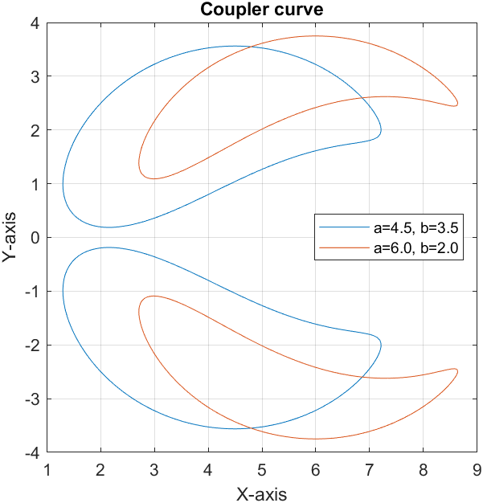
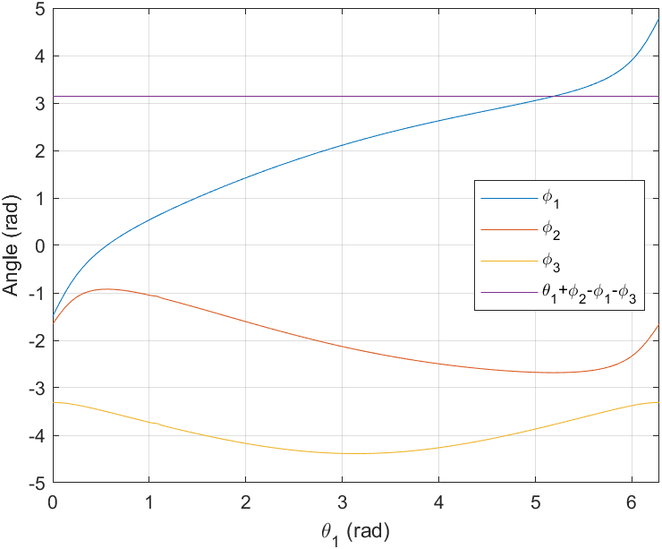
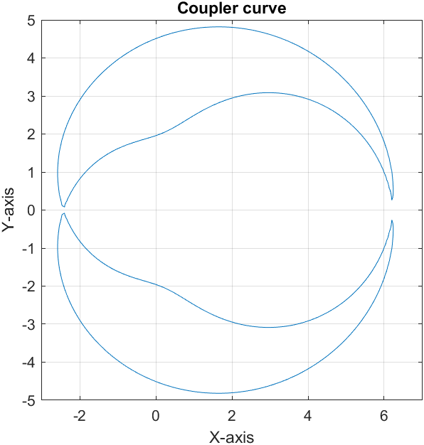
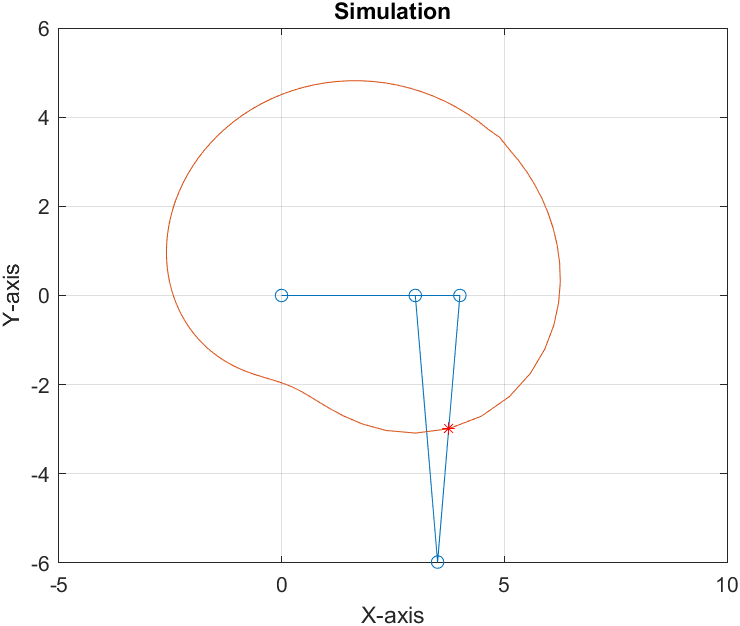

## Week 4 - Assignment 4

Codes present for

1.  MCQ - Q8

2.  Subjective - Q1 and Q3

**Plots**

1.  MCQ : Q8

    

     
    

2.  Subjective : Q1

    

     
    

    

     
    

    

     
    

3.  Subjective : Q3

    

     
    

