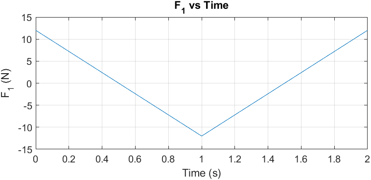
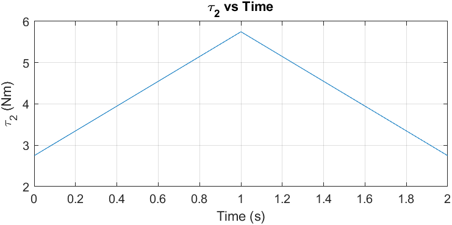
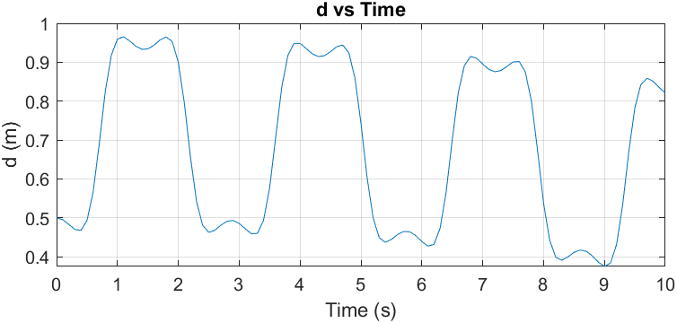
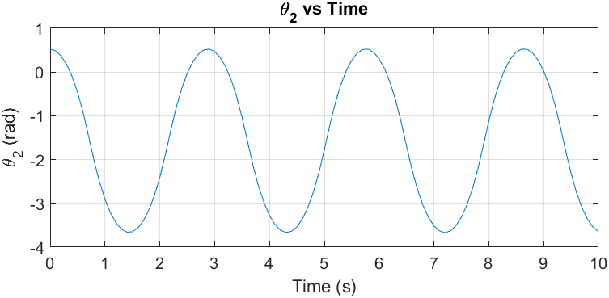
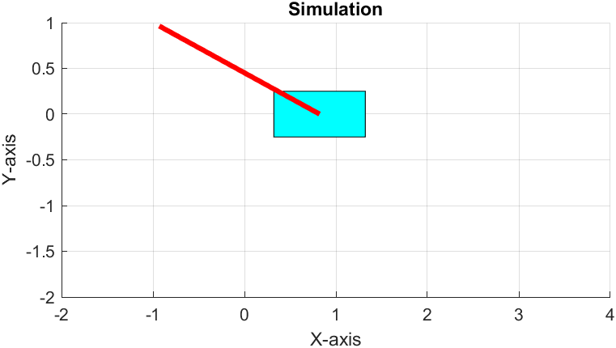

## Week 8 - Assignment 8

Codes present for

1.  MCQ - NIL

2.  Subjective - Q2 and Q3

**Plots**

1.  Subjective : Q2

    

     
    

    

     
    

2.  Subjective : Q3

    

     
    

    

     
    

    

     
    

