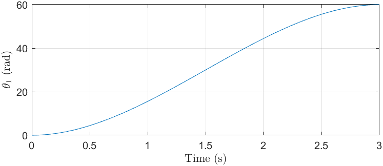
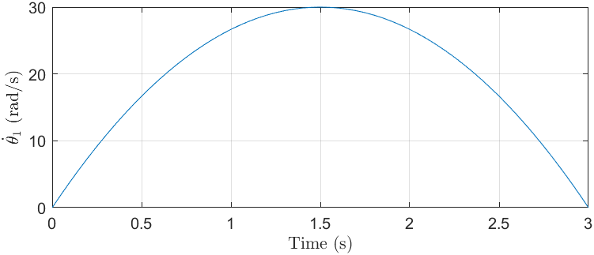
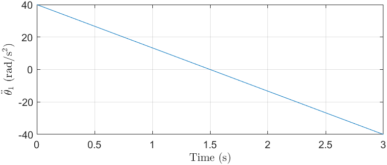
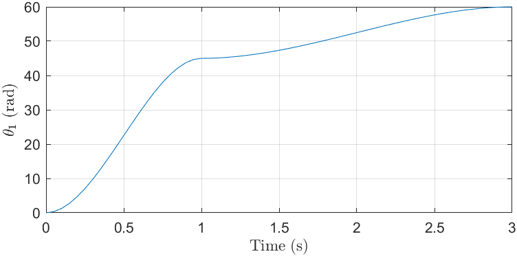
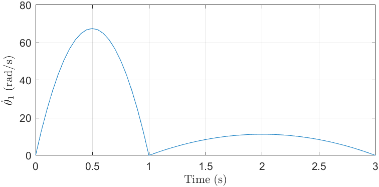
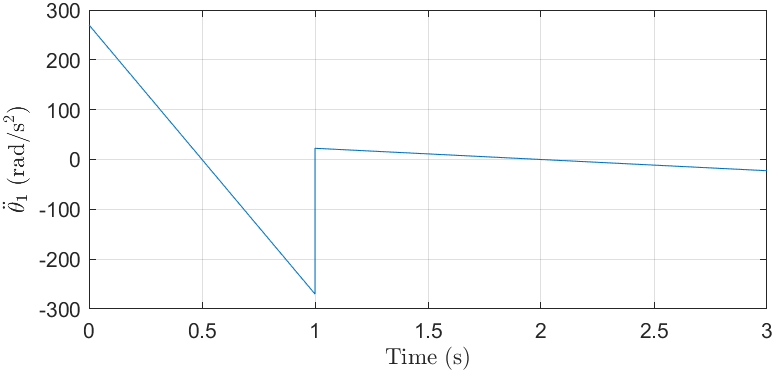
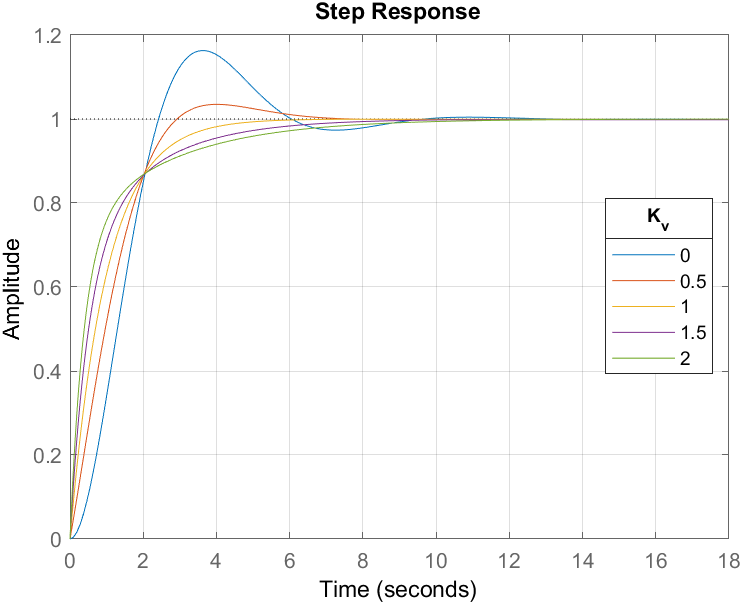
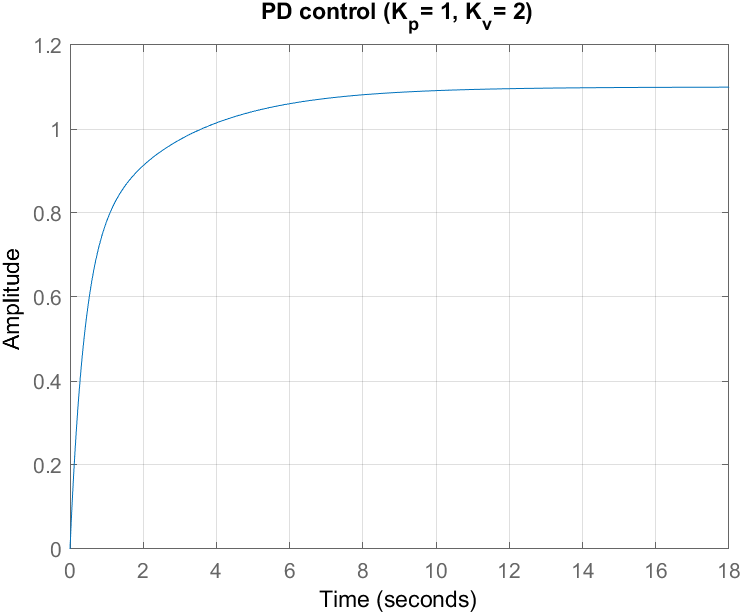
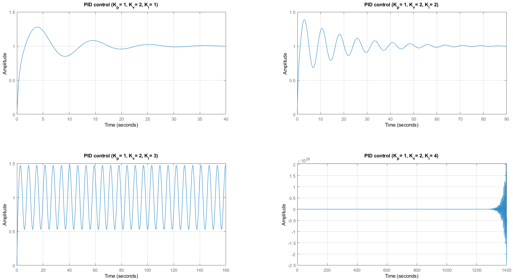
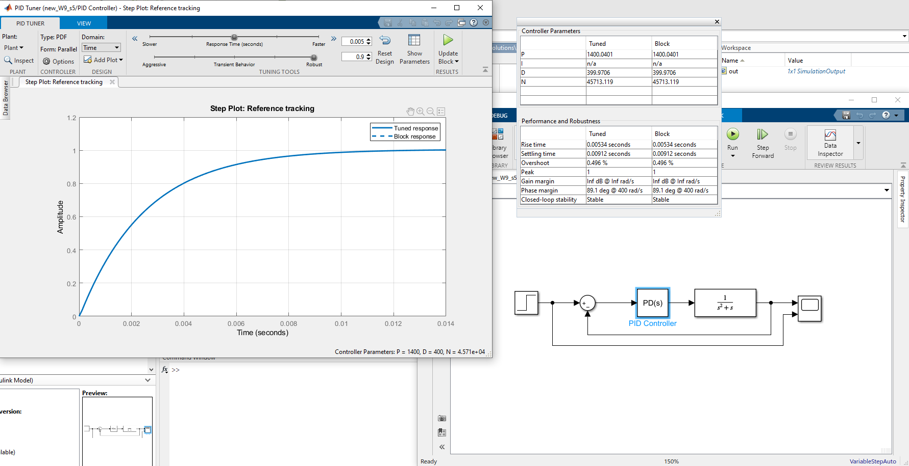

## Week 9 - Assignment 9

Codes present for

1.  MCQ - NIL

2.  Subjective - Q1, Q2, Q3, Q4 and Q5

_Note_ : Q5 is solved by SIMULINK. Use the <code>W9_S5.slx</code> file for the solution.

**Plots**
  1\. Subjective : Q1

  

  
  

  

    
  

  

   
  

  

  
  

2.  Subjective : Q2

    

    
    

    

      
    

    

     
    

    

    
    

3.  Subjective : Q3

    

     
    

4.  Subjective : Q4

    

     
    

    

     
    

5.  Subjective : Q5

     

    

